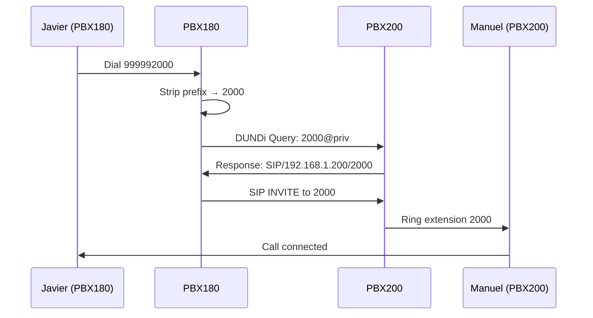

This example demonstrates how to interconnect two Asterisk PBX systems using DUNDi (Distributed Universal Number Discovery), allowing users on different PBX systems to call each other seamlessly.

## Overview

DUNDi enables:
- **Transparent dialing** between multiple PBX systems
- **Distributed dial plan** with no central point of failure
- **Secure communication** using RSA key pairs
- **Load balancing** and redundancy
- **Extension number portability** across systems

## Architecture

This setup connects two PBX systems:

- **PBX180** (192.168.1.180): Extensions 4XXX (Javier, Belen)
- **PBX200** (192.168.1.200): Extensions 2XXX (Manuel, Maria)

Users dial `99999` + extension to reach users on the other PBX.

## Configuration Files

### PBX180 Configuration

<CodeGroup>

```ini /etc/asterisk/sip.conf (PBX180)
[general]
port=5060
directmedia=no
language=es
context=public
allowoverlap=no
udpbindaddr=0.0.0.0
tcpenable=no
tcpbindaddr=0.0.0.0
transport=udp
srvlookup=yes

; TLS configuration for secure SIP
tlsenable=yes
tlsbindaddr=0.0.0.0
tlscertfile=/etc/asterisk/keys/asterisk.pem
tlscafile=/etc/asterisk/keys/ca.crt
tlscipher=ALL
tlsclientmethod=tlsv1

; SIP messaging support
accept_outofcall_message=yes
outofcall_message_context=mensajes
auth_message_requests=yes
subscribecontext=suscribir

[authentication]

[javier]
type=friend
secret=310195
context=empleado
host=dynamic
canreinvite=no
nat=force_rport,comedia
callgroup=2
pickupgroup=2
transport=tls              ; Use TLS for encryption

[belen]
type=friend
secret=120995
context=empleado
host=dynamic
canreinvite=no
nat=force_rport,comedia
callgroup=2
pickupgroup=2

[director]
type=friend
secret=130261
context=direccion
host=dynamic
canreinvite=no
nat=force_rport,comedia
callgroup=1
pickupgroup=1,2

[oscar]
type=friend
secret=201097
context=entrantes
host=dynamic
canreinvite=no
nat=force_rport,comedia

[exterior]
type=friend
secret=123456
context=entrantes
host=dynamic
canreinvite=no
nat=force_rport,comedia

; DUNDi peer configuration
[priv]
type=peer
context=dundi-priv-local
disallow=all
allow=ilbc
```

```ini /etc/asterisk/extensions.conf (PBX180)
[general]
static=yes
writeprotect=no
clearglobalvars=no

[globals]
CONSOLE=Console/dsp
IAXINFO=guest
TRUNK=DAHDI/G2
TRUNKMSD=1

[empleado]
;####-Extensiones habilitadas-####
; Javier
exten => 4000,1,NoOp(Llamando a Javier)
same => n,Dial(SIP/javier,15)
same => n,VoiceMail(${EXTEN})
same => n,Hangup()

; Belen
exten => 4001,1,NoOp(Llamando a Belen)
same => n,Dial(SIP/belen,15)
same => n,VoiceMail(${EXTEN})
same => n,Hangup()

; Centralita
exten => 100,1,NoOp(Centralita de distribucion de llamadas)
same => n,NoOp(Esta llamando ${ODBC_info(${CALLERID(number)})})
same => n,Festival(Va a escuchar un fragmento de la primavera de Antonio Vivaldi)
same => n,Playback(silence/1)
same => n,Playback(mimusica/primavera)
same => n,Hangup()

; Director
exten => 5000,1,NoOp(Llamando al director)
same => n,Dial(SIP/director,15)
same => n,Hangup()

; Recepcion queue
exten => 4444,1,NoOp(Recepcion)
same => n,Set(CHANNEL(musicclass)=recepcion)
same => n,Answer()
same => n,Queue(recepcion,,,,120)
same => n,Hangup()

;####-Buzones de voz-####
exten => *4000,1,VoiceMailMain(4000)
same => n,Hangup()

exten => *4001,1,VoiceMailMain(4001)
same => n,Hangup()

;####-Captura de llamadas-####
exten =>  _*8.,1,NoOp(Capturando llamada a la extension ${EXTEN:2})
same => n,Pickup(${EXTEN:2})
same => n,Hangup()

;####-Llamadas desde el exterior que no tienen extension asociada-####
exten => _4XXX,1,Answer()
same => n,Festival(La extension ${extension} no se encuentra disponible)
same => n,Hangup()

;####-Conexion DUNDi-####
; Dial 99999 + 4-digit extension to reach PBX200
exten => _99999XXXX,1,NoOP(Llamando a ${EXTEN} - ${EXTEN:5})
same => n,Macro(dundi-priv,${EXTEN:5})

[entrantes]
;####-Extensiones habilitadas-####
; Llamada a grupo (belen+javier)
exten => 4040,1,NoOp(Llamando al grupo 'empleados')
same => n,Dial(SIP/javier&SIP/belen,60)
same => n,Hangup()

; Redireccion a la extension marcada con horario L-V de 8 a 20h
exten => _995554XXX,1,Set(extension=${EXTEN:5})
same => n,NoOp(Llamando a la extension ${extension})
same => n,GotoIfTime(8:00-20:00,mon-fri,*,*?empleado,${extension},1)
same => n,Festival(En estos momentos no hay nadie que te pueda atender)
same => n,Festival(Nuestro horario es de 8 a 20 horas de lunes a viernes)
same => n,Hangup()

[direccion]
exten => 4000,1,NoOp(Llamando a Javier)
same => n,Dial(SIP/javier,15)
same => n,VoiceMail(${EXTEN})
same => n,Hangup()

exten => 4001,1,NoOp(Llamando a Belen)
same => n,Dial(SIP/belen,15)
same => n,VoiceMail(${EXTEN})
same => n,Hangup()

exten =>  _*8.,1,NoOp(Capturando llamada a la extension ${EXTEN:2})
same => n,Pickup(${EXTEN:2}@empleado)
same => n,Hangup()

[suscribir]
exten => 4000,hint,SIP/javier
exten => 4001,hint,SIP/belen

[mensajes]
exten => _X.,1,NoOp(Mensaje de ${MESSAGE(from)})
same => n,NoOp(Mensaje para ${MESSAGE(to)})
same => n,NoOp(Cuerpo del mensaje: ${MESSAGE(body)})
same => n,Set(dest=${EXTEN})
same => n,Set(remitente=${CUT(MESSAGE(from),<,2)})
same => n,Set(remitente=${CUT(remitente,@,1)})
same => n,Set(remitente=${CUT(remitente,:,2)})
same => n,Set(texto=${MESSAGE(body)})
same => n,Set(MESSAGE(body)=${remitente}: ${texto})
same => n,GotoIf($["${EXTEN}" = "4000"]?4000)
same => n,GotoIf($["${EXTEN}" = "4001"]?4001)
same => n,MessageSend(${EXTEN}, Centro de Mensajes(CdM))
same => n,Noop(Estado del mensaje ${MESSAGE_SEND_STATUS})
same => n,GotoIf($["${MESSAGE_SEND_STATUS}" != "SUCCESS"]?fallo,s,1)
same => n,Hangup()

exten => 4000,4000,NoOp(Mensaje a Javier)
same => n,MessageSend(sip:javier, Centro de Mensajes(CdM))
same => n,Noop(Estado del mensaje ${MESSAGE_SEND_STATUS})
same => n,GotoIf($["${MESSAGE_SEND_STATUS}" != "SUCCESS"]?fallo,s,1)
same => n,Hangup()

exten => 4001,4001,NoOp(Mensaje a Belen)
same => n,MessageSend(sip:belen, Centro de Mensajes(CdM))
same => n,Noop(Estado del mensaje ${MESSAGE_SEND_STATUS})
same => n,GotoIf($["${MESSAGE_SEND_STATUS}" != "SUCCESS"]?fallo,s,1)
same => n,Hangup()

[fallo]
exten => s,1,Set(MESSAGE(body)=CdM: El mensaje "${texto}" para ${dest} no ha sido enviado)
same => n,Set(remit=${CUT(MESSAGE(from),<,2)})
same => n,Set(remit=${CUT(remit,@,1)})
same => n,MessageSend(${remit},Centro de Mensajes(CdM))
same => n,NoOp(Estado del mensaje ${MESSAGE_SEND_STATUS})
same => n,Hangup()

;####-INI-DUNDI-####
[dundi-priv-canonical]
exten => _4XXX,1,Dial(Zap/g1/${EXTEN},20,rtT)

[dundi-priv-customers]

[dundi-priv-via-pstn]

[dundi-priv-local]
include => dundi-priv-canonical
include => dundi-priv-customers
include => dundi-priv-via-pstn

[dundi-priv-switch]
switch => DUNDi/priv

[dundi-priv-lookup]
include => dundi-priv-local
include => dundi-priv-switch

[macro-dundi-priv]
exten => s,1,NoOp(Macro dundi-priv de PBX180)
same => n,Goto(${ARG1},1)
include => dundi-priv-lookup
;####-FIN-DUNDI-####

[public]
include => demo
include => empleado

[default]
include => demo
```

```ini /etc/asterisk/dundi.conf (PBX180)
[general]
ttl=32                  ; Time to live for DUNDi queries
autokill=yes            ; Automatically kill stale peers

[mappings]
; Map private extensions to this PBX
priv => dundi-priv-canonical,0,SIP,192.168.1.180/${NUMBER},nopartial
priv => dundi-priv-customers,100,SIP,192.168.1.180/${NUMBER},nopartial
priv => dundi-priv-via-pstn,400,SIP,192.168.1.180/${NUMBER},nopartial

; Define PBX200 as a DUNDi peer
[00:0C:29:52:7C:20]     ; MAC address of PBX200
model = symmetric       ; Symmetric peering (both can query each other)
host = 192.168.1.200    ; IP address of PBX200
inkey = PBX200          ; Public key of PBX200 (for verification)
outkey = PBX180         ; Private key of PBX180 (for signing)
include = priv          ; Include 'priv' context
permit = priv           ; Permit queries for 'priv' context
qualify = yes           ; Ping peer to check availability
order = primary         ; This is a primary peer
```

</CodeGroup>

### PBX200 Configuration

<CodeGroup>

```ini /etc/asterisk/sip.conf (PBX200)
[general]
port=5060
directmedia=no
language=es
context=public
allowoverlap=no
udpbindaddr=0.0.0.0
tcpenable=no
tcpbindaddr=0.0.0.0
transport=udp
srvlookup=yes
tlsenable=yes
tlsbindaddr=0.0.0.0
tlscertfile=/etc/asterisk/keys/asterisk.pem
tlscafile=/etc/asterisk/keys/ca.crt
tlscipher=ALL
tlsclientmethod=tlsv1
accept_outofcall_message=yes
outofcall_message_context=mensajes
auth_message_requests=yes
subscribecontext=suscribir

[authentication]

[manuel]
type=friend
secret=123456
context=empleado
host=dynamic
canreinvite=no
nat=force_rport,comedia
callgroup=2
pickupgroup=2
transport=tls

[maria]
type=friend
secret=123456
context=empleado
host=dynamic
canreinvite=no
nat=force_rport,comedia
callgroup=2
pickupgroup=2

[director]
type=friend
secret=130261
context=direccion
host=dynamic
canreinvite=no
nat=force_rport,comedia
callgroup=1
pickupgroup=1,2

[priv]
type=peer
context=dundi-priv-local
disallow=all
allow=ilbc
```

```ini /etc/asterisk/extensions.conf (PBX200)
[empleado]
; Manuel
exten => 2000,1,NoOp(Llamando a Manuel)
same => n,Dial(SIP/manuel,15)
same => n,Hangup()

; Maria
exten => 2001,1,NoOp(Llamando a Maria)
same => n,Dial(SIP/maria,15)
same => n,Hangup()

exten => *2000,1,VoiceMailMain(2000)
same => n,Hangup()

exten => *2001,1,VoiceMailMain(2001)
same => n,Hangup()

exten =>  _*8.,1,NoOp(Capturando llamada a la extension ${EXTEN:2})
same => n,Pickup(${EXTEN:2})
same => n,Hangup()

;####-Conexion DUNDi-####
; Dial 99999 + 4-digit extension to reach PBX180
exten => _99999XXXX,1,NoOP(Llamando a ${EXTEN} - ${EXTEN:5})
same => n,Macro(dundi-priv,${EXTEN:5})

;####-INI-DUNDI-####
[dundi-priv-canonical]
exten => _2XXX,1,Dial(Zap/g1/${EXTEN},20,rtT)

[dundi-priv-customers]

[dundi-priv-via-pstn]

[dundi-priv-local]
include => dundi-priv-canonical
include => dundi-priv-customers
include => dundi-priv-via-pstn

[dundi-priv-switch]
switch => DUNDi/priv

[dundi-priv-lookup]
include => dundi-priv-local
include => dundi-priv-switch

[macro-dundi-priv]
exten => s,1,NoOp(Macro dundi-priv de PBX200)
same => n,Goto(${ARG1},1)
include => dundi-priv-lookup
;####-FIN-DUNDI-####
```

```ini /etc/asterisk/dundi.conf (PBX200)
[general]
ttl=32
autokill=yes

[mappings]
priv => dundi-priv-canonical,0,SIP,192.168.1.200/${NUMBER},nopartial
priv => dundi-priv-customers,100,SIP,192.168.1.200/${NUMBER},nopartial
priv => dundi-priv-via-pstn,400,SIP,192.168.1.200/${NUMBER},nopartial

; Define PBX180 as a DUNDi peer
[00:0C:29:CB:EB:C6]     ; MAC address of PBX180
model = symmetric
host = 192.168.1.180    ; IP address of PBX180
inkey = PBX180          ; Public key of PBX180
outkey = PBX200         ; Private key of PBX200
include = priv
permit = priv
qualify = yes
order = primary
```

</CodeGroup>

## Setting Up DUNDi

### Step 1: Generate RSA Key Pairs

On **PBX180**:

```bash
cd /var/lib/asterisk/keys
asterisk -rx "keys init"
asterisk -rx "keys create PBX180"
```

This creates:
- `PBX180.key` - Private key (keep secret)
- `PBX180.pub` - Public key (share with other PBX)

On **PBX200**:

```bash
cd /var/lib/asterisk/keys
asterisk -rx "keys init"
asterisk -rx "keys create PBX200"
```

### Step 2: Exchange Public Keys

Copy public keys between systems:

```bash
# Copy PBX200.pub from PBX200 to PBX180
scp root@192.168.1.200:/var/lib/asterisk/keys/PBX200.pub /var/lib/asterisk/keys/

# Copy PBX180.pub from PBX180 to PBX200
scp root@192.168.1.180:/var/lib/asterisk/keys/PBX180.pub /var/lib/asterisk/keys/
```

Set proper permissions:

```bash
chown asterisk:asterisk /var/lib/asterisk/keys/*
chmod 600 /var/lib/asterisk/keys/*.key
chmod 644 /var/lib/asterisk/keys/*.pub
```

### Step 3: Get MAC Addresses

On each PBX, find the MAC address:

```bash
ip link show | grep ether
```

Use this MAC address in the other PBX's `dundi.conf`.

### Step 4: Restart Asterisk

On both PBX systems:

```bash
sudo systemctl restart asterisk
```

## Testing Instructions

### Step 1: Verify DUNDi Peers

On **PBX180**:

```
asterisk> dundi show peers
EID                           Host                  Model      AvgTime  Status
00:0C:29:52:7C:20             192.168.1.200         Symmetric       10  OK
```

On **PBX200**:

```
asterisk> dundi show peers
EID                           Host                  Model      AvgTime  Status
00:0C:29:CB:EB:C6             192.168.1.180         Symmetric       12  OK
```

### Step 2: Test DUNDi Lookups

From **PBX180**, query for extension 2000:

```
asterisk> dundi lookup 2000@priv
```

Expected output:

```
DUNDi lookup returned:
   1. 0 SIP/192.168.1.200/2000 from 00:0C:29:52:7C:20, expires in 3600 s
```

From **PBX200**, query for extension 4000:

```
asterisk> dundi lookup 4000@priv
```

### Step 3: Make Test Calls

**From Javier (PBX180, ext 4000) to Manuel (PBX200, ext 2000):**

1. Dial `999992000`
2. PBX180 strips `99999` prefix
3. DUNDi looks up `2000@priv`
4. PBX200 responds with routing info
5. Call is routed to Manuel's phone

**From Manuel (PBX200, ext 2000) to Belen (PBX180, ext 4001):**

1. Dial `999994001`
2. PBX200 strips `99999` prefix
3. DUNDi looks up `4001@priv`
4. PBX180 responds with routing info
5. Call is routed to Belen's phone

### Step 4: Monitor with CLI

Enable verbose logging:

```
asterisk> core set verbose 5
asterisk> core set debug 5
```

Watch for DUNDi queries:

```
-- Executing [999992000@empleado:1] NoOp("SIP/javier-00000000", "Llamando a 999992000 - 2000") in new stack
-- Executing [999992000@empleado:2] Macro("SIP/javier-00000000", "dundi-priv,2000") in new stack
-- DUNDi lookup for '2000' in context 'priv'
-- DUNDi result: SIP/192.168.1.200/2000
-- Executing [2000@dundi-priv-canonical:1] Dial("SIP/javier-00000000", "SIP/192.168.1.200/2000,20,rtT") in new stack
```

## Network Configuration

### Firewall Rules

Allow DUNDi traffic on both PBX systems:

```bash
# DUNDi uses UDP port 4520
sudo ufw allow 4520/udp

# SIP signaling
sudo ufw allow 5060/udp

# RTP media
sudo ufw allow 10000:20000/udp
```

### Network Connectivity

Ensure both PBX systems can reach each other:

```bash
# From PBX180
ping 192.168.1.200

# From PBX200
ping 192.168.1.180
```

## DUNDi Query Flow



## Troubleshooting

### DUNDi Peers Not Showing

1. **Check network connectivity:**
   ```bash
   ping <other-pbx-ip>
   telnet <other-pbx-ip> 4520
   ```

2. **Verify key files exist:**
   ```bash
   ls -la /var/lib/asterisk/keys/
   ```

3. **Check MAC address in dundi.conf:**
   ```bash
   ip link show | grep ether
   ```

4. **Review DUNDi debug output:**
   ```
   asterisk> dundi set debug on
   ```

### Calls Not Routing

1. **Test DUNDi lookup manually:**
   ```
   asterisk> dundi lookup 2000@priv
   ```

2. **Check dial plan:**
   ```
   asterisk> dialplan show empleado
   ```

3. **Verify macro exists:**
   ```
   asterisk> dialplan show macro-dundi-priv
   ```

### Permission Denied Errors

1. **Check key file permissions:**
   ```bash
   ls -la /var/lib/asterisk/keys/
   ```

2. **Fix ownership:**
   ```bash
   chown asterisk:asterisk /var/lib/asterisk/keys/*
   ```

## Security Considerations

### RSA Key Protection

- **Never share private keys** (`.key` files)
- Only share **public keys** (`.pub` files)
- Store private keys with `600` permissions
- Regenerate keys if compromised

### Network Isolation

- Use **VPN or private network** for DUNDi traffic
- Don't expose DUNDi port (4520) to public internet
- Consider **firewalling** DUNDi to specific IP addresses

### Access Control

- Use `permit` and `deny` in dundi.conf
- Limit contexts shared via DUNDi
- Implement **call authorization** in dial plan

## Advanced Configuration

### Load Balancing

Define multiple paths with different weights:

```ini
[mappings]
priv => dundi-priv-canonical,0,SIP,192.168.1.180/${NUMBER},nopartial
priv => dundi-priv-backup,100,SIP,192.168.1.181/${NUMBER},nopartial
```

### Caching

Adjust TTL for caching DUNDi results:

```ini
[general]
ttl=32                  ; Cache results for 32 hops
cachetime=3600          ; Cache for 1 hour
```

### Multiple Contexts

Share different extension ranges:

```ini
[mappings]
priv => dundi-priv-canonical,0,SIP,${IP}/${NUMBER},nopartial
e164 => dundi-e164-canonical,0,SIP,${IP}/${NUMBER},nopartial
```

## Next Steps

- Add more PBX systems to the DUNDi network
- Implement [failover routing](/advanced/pbx-interconnection)
- Set up [least-cost routing](/advanced/dundi-protocol)
- Configure [geographic redundancy](/advanced/pbx-interconnection)
